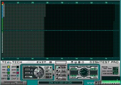



## Disktest PRO

### Description

UPDATED. The update resolves overflow error with read/write/verify all on.

Disktest PRO is a program to analyze, repair or

modify 3.5" Double Sided High Density floppy disks on first floppy

drive (A:). You can test floppy disks, search for bad sectors, repair

bad sectors, format, quick format, recover data on bad sectors,

make backups, mark/unmark bad sectors, erase data without using files,

test floppy disk speed on reading. Data, when recovered, is 100%

reliable. More than 3 pass testing is made to recover bad sectors. You

can also format individual parts of the disk even with bad sectors

on system area. All tasks can be viewed in an interface that lets the

user see what is going on and where on the disk. All disk sectors are

visible but more views are available. From the same author as Fast Graphics Filters and Floorplan Designer.
 
### More Info
 

             |
---                |---
**Submitted On**   |2006-11-05 18:52:46
**By**             |[Manuel Augusto Nogueira dos Santos](https://github.com/Planet-Source-Code/PSCIndex/blob/master/ByAuthor/manuel-augusto-nogueira-dos-santos.md)
**Level**          |Advanced
**User Rating**    |4.9 (88 globes from 18 users)
**Compatibility**  |VB 6\.0
**Category**       |[Complete Applications](https://github.com/Planet-Source-Code/PSCIndex/blob/master/ByCategory/complete-applications__1-27.md)
**World**          |[Visual Basic](https://github.com/Planet-Source-Code/PSCIndex/blob/master/ByWorld/visual-basic.md)
**Archive File**   |[Disktest\_P2029401162006\.zip](https://github.com/Planet-Source-Code/manuel-augusto-nogueira-dos-santos-disktest-pro__1-66946/archive/master.zip)

